Hi all!

**Here are step-by-step tutorial, which explain how to integrate Auth0 with DreamFactory via OpenID service.**

You can find example application from this tutorial in this GitHub repository:
[df-int-auth0-openid](https://github.com/dreamfactorysoftware/df-int-auth0-openid)

So, let's start!

**NOTE:** If you face with CORS problem, check DreamFactory [CORS configuration](#and-dont-forget-add-your-application-and-auth0-to-dreamfactory--config--cors) section in the end of this README.md

## Configuration connection between services

1. Create account on **https://auth0.com/** (if not exist yet) and log in.
2. Go to [Dashboard](https://manage.auth0.com/dashboard/) > [Applications](https://manage.auth0.com/dashboard/us/dev-9c6j1ina/applications)
3. Click on **``+ Create Application``** button and select needed application type (in this tutorial I use **Regular Web Application**).
4. Go to **Settings** tab

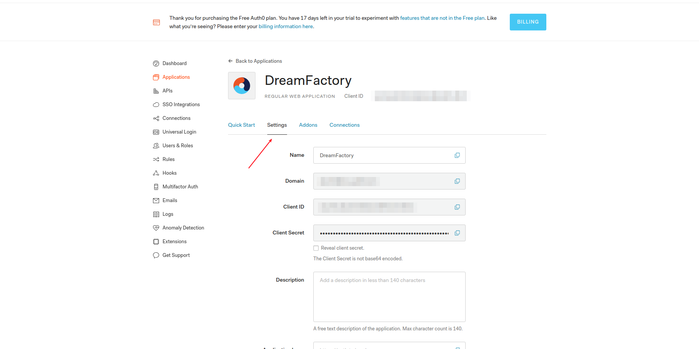

5. Open admin DF app in new window.
6. Create OpenID service on **Services** tab

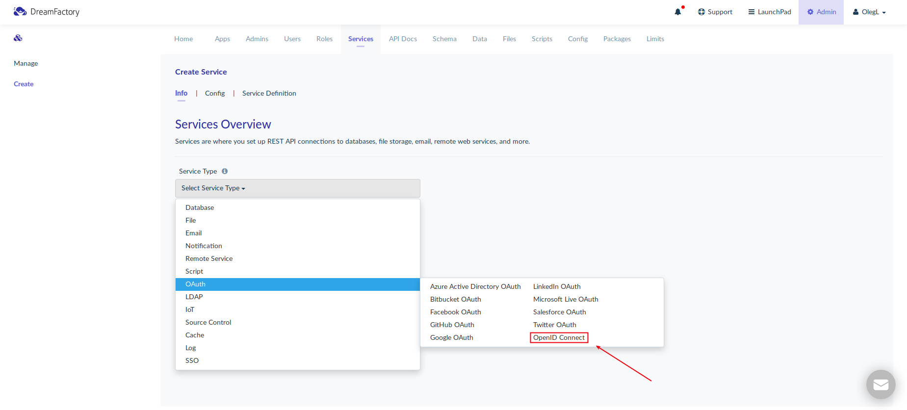

7. Configure Auth0 service
     - configure on **Info** tab
     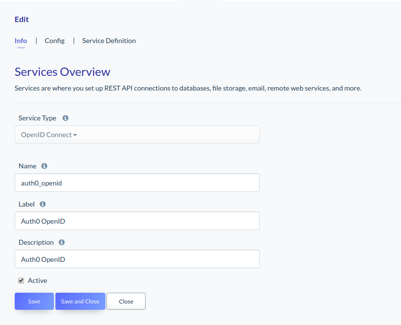
     - go on **Config** tab
     - copy **Client ID** and **Client Secret**
     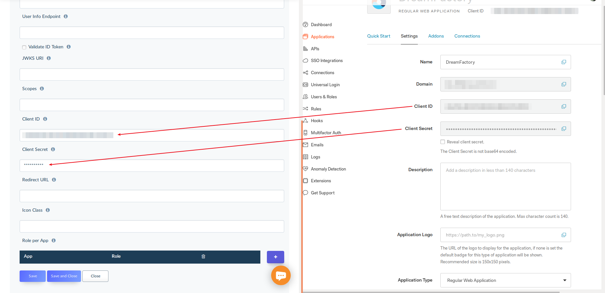
     - scroll down and click on the **Advanced Settings** link and copy **OpenID Configuration**
     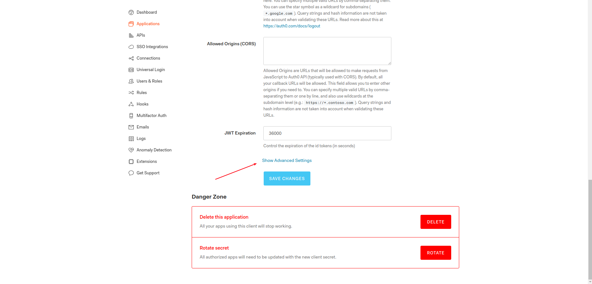
     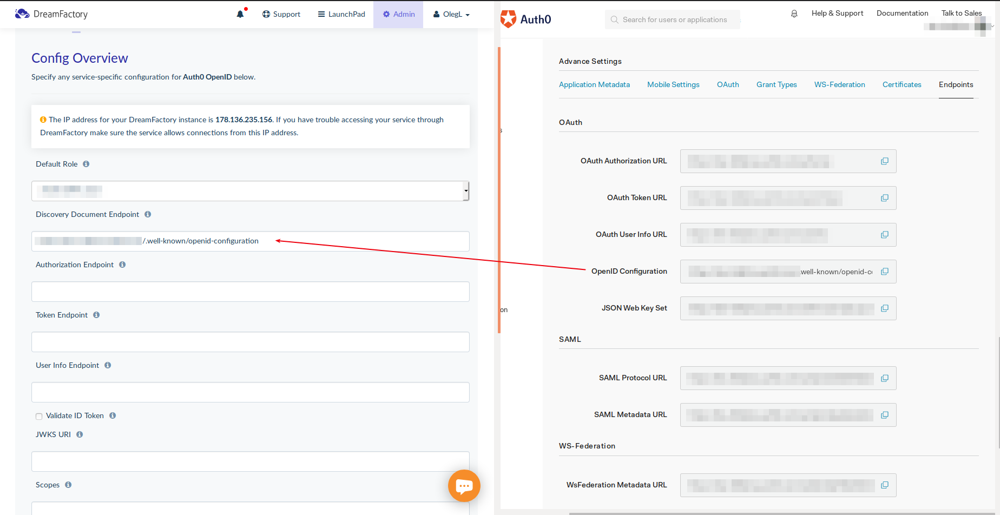
     - add **Redirect URL**
     It has to be your application endpoint where you will process response from OpenID server. More about it in next steps.
     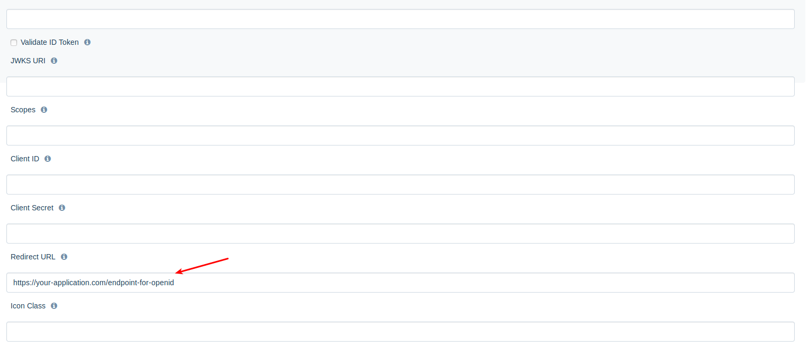
     - click on **``Save``** button on DF admin app
     - after clicking on **``Save``** button, empty fields such like **Token Endpoint**, **Authorization Endpoint**, **Scopes**, etc. have to be filled in automatically.

## Add new role for Auth0 users on DreamFactory

1. Create role for users which will sign in via Auth0 OpenID (if you already have some roles you can use them). Role with full access: 

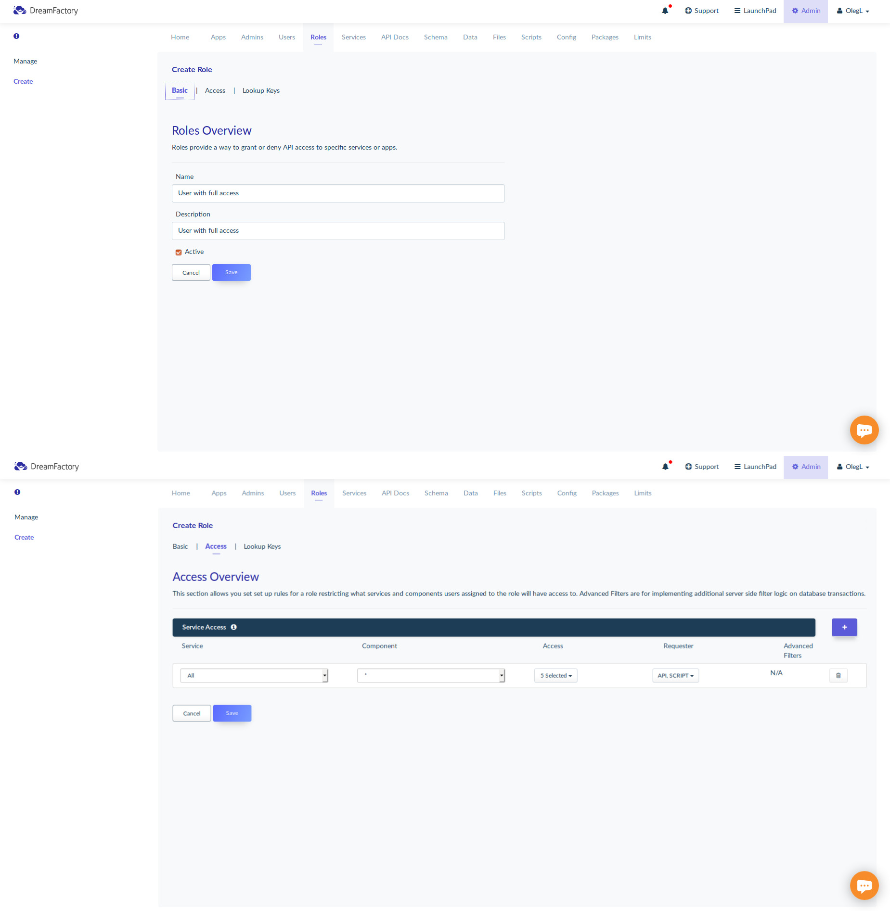

2. Create API key on tab **Apps** and assign needed role to this key

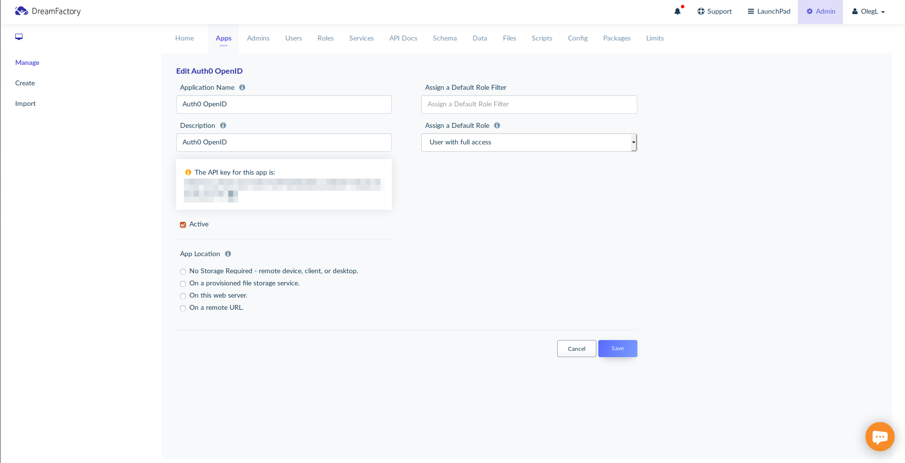

3. Assign needed role to Auth0 service

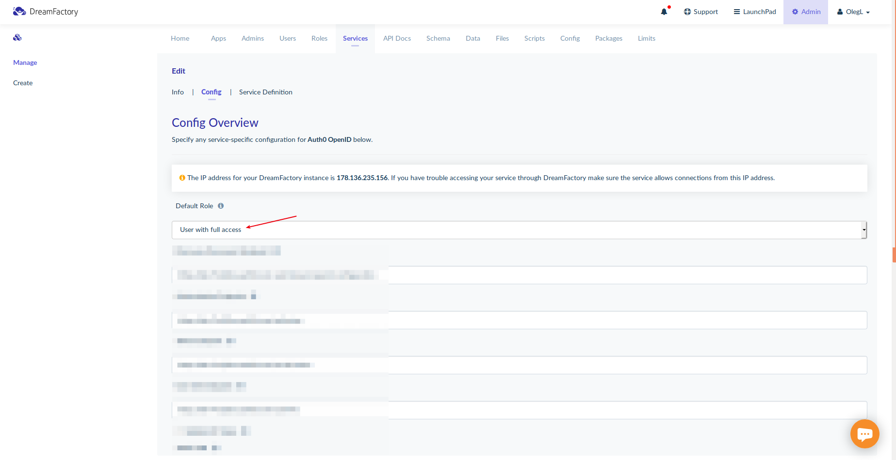

## What should be the workflow?

1. Send **POST** request to:
**``https://{{your_instance_domain}}/api/v2/user/session?service={{name_of_openid_service}}``**
with **``X-Requested-With``** header with value **``XMLHttpRequest``**.
Response has to look like this:
```json
{
    "response": {
        "redirect": true,
        "url": "this_url_forwards_users_to_openid_server_sign_in_form"
    }
}
```

2. Redirect user to **``url``** from response in first step. After redirect, users have to see server's sign in form if user is not signed into OpenID server before.

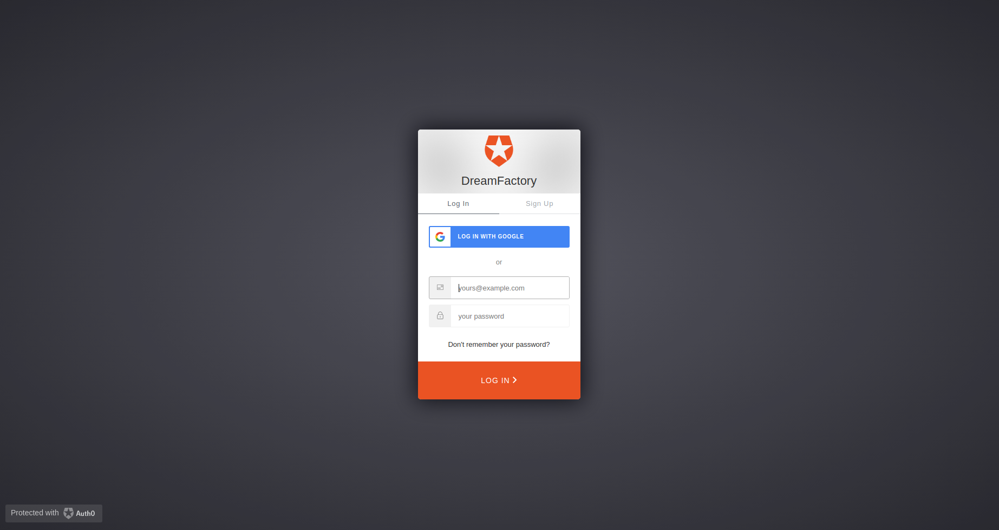

3. After success authentication user will be redirected to **Redirect URL** from **Config** tab. OpenID provider will append ``code`` and ``state`` parameters to this URL after authentication.

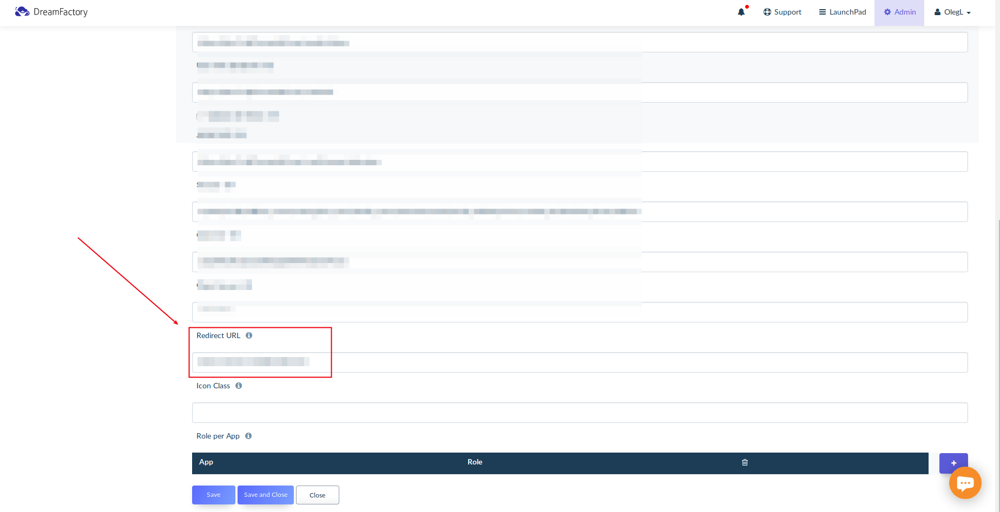

So, after authentication URL have to looks like this:

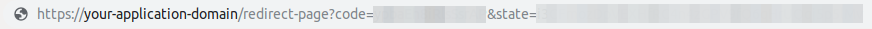

4. Send **POST** request to:
**``https://{{your_instance_domain}}/api/v2/user/session?oauth_callback=true&code={{code_from_previous_step}}&state={{state_from_previous_step}}``**
with ``code`` and ``state`` params from previous step.
Response should looks like this:

```json
{
    "session_token": "SESSION_TOKEN",
    "session_id": "SESSION_TOKEN",
    "id": 5,
    "name": "test@test.com",
    "first_name": "test@test.com",
    "last_name": null,
    "email": "test+auth0_openid@test.com",
    "is_sys_admin": false,
    "last_login_date": "2019-05-01 08:25:02",
    "host": "HOST",
    "oauth_token": "OAUTH_TOKEN",
    "id_token": "ID_TOKEN"
}
```

Now users can use ``session_token`` as ``X-DreamFactory-Session-Token`` for accessing to DreamFactory instance.

## Example application and its configuration

Almost done. There are a few more steps left. :)

Now we can sign in by sending POST request onto ``/api/v2/user/session?service={{name_of_openid_service}}`` endpoint. In my example application I assign JS event on **``Sign in with Auth0 OpenID``** button. 

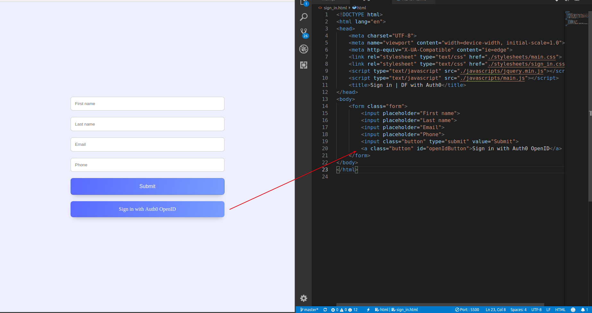

Clicking this button, user send **POST** request to DreamFactory instance. DreamFactory returns URL and my example application redirects users to this URL, where they faced with OpenID provider sign in form. 

```javascript
$("#openIdButton").click(() => {
    $.ajax({
        type: "POST",
        url: DF_AUTH0_OPENID_SIGN_IN_ENDPOINT,
        headers: {
            'X-Requested-With': 'XMLHttpRequest'
        },
        success: function (data) {
            window.location = data.response.url;
        }
    })
})
```


After signing in, users will be redirected to **``Redirect URL``**, where in URL users have to see also ``code`` and ``state`` params.


But before, you should add your application's URL to **Allowed Callback URLs**, because Auth0 allows use only URL from this list.


JS from my application sends **POST** request to DreamFactory instance with ``code`` and ``state`` params from previous step and saves ``session_token`` from response into ``localStorage``

```javascript
$.ajax({
    type: "POST",
    url: DF_AUTH0_OPENID_CALLBACK_ENDPOINT + '&code=' + url.searchParams.get('code') + '&state=' + url.searchParams.get('state'),
    async: false,
    success: function (data) {
        localStorage.setItem('token', data.session_token);
        localStorage.setItem('name', getUserName());
    }
})
```

Now I can communicate with DreamFactory including **``X-DreamFactory-Session-Token``** and **``X-DreamFactory-API-Key``** into request header.
```javascript
function getUserName() {
    var userName = "";
    $.ajax({
        type: "GET",
        url: DF_PROFILE_ENDPOINT,
        headers: {
            'X-DreamFactory-API-Key': DF_PROFILE_ENDPOINT,
            'X-DreamFactory-Session-Token': getSessionToken()
        },
        async: false,
        success: function (data) {
            userName = data.name;
        },
    });
    return userName;
}
```

 **``X-DreamFactory-API-Key``** you can find on **Apps** tab in DreamFactory admin application.

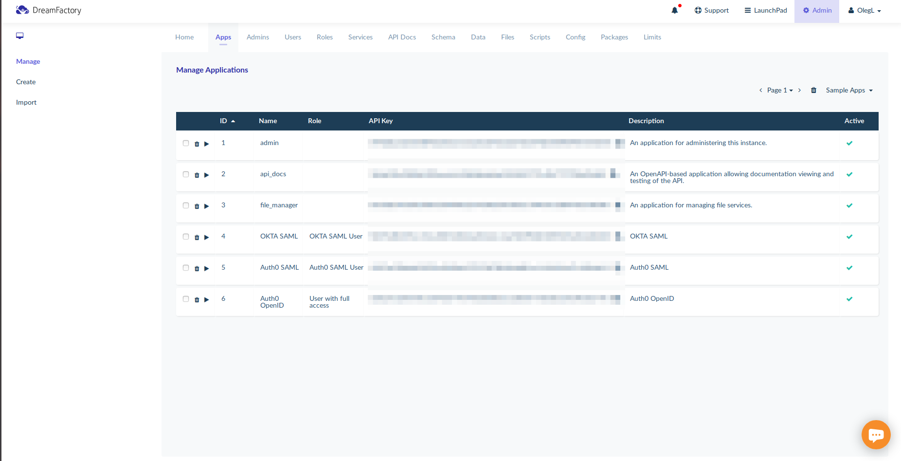

## And don't forget add your application and Auth0 to **DreamFactory** > **Config** > **CORS**
My CORS config allows any requests to all DreamFactory endpoint with any headers. You can configure it more secure.

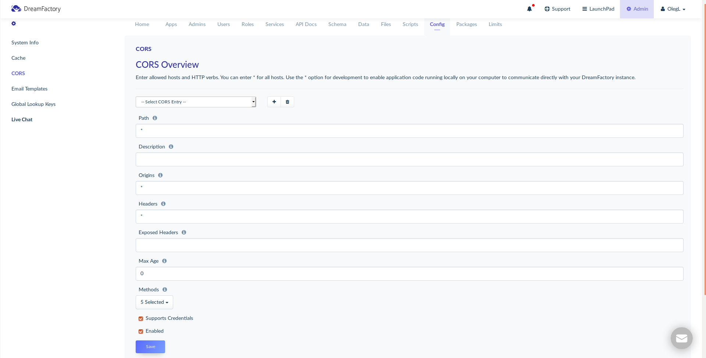
